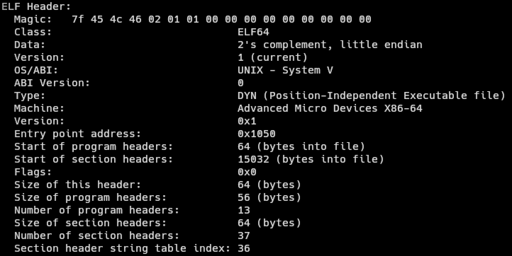
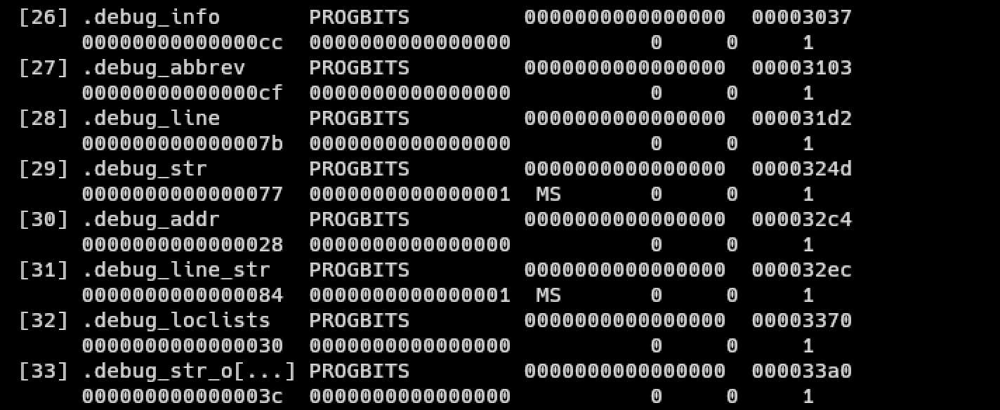
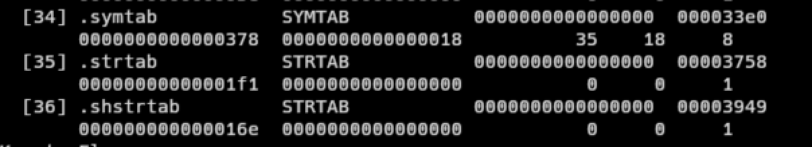

+++
title = 'Parsing Elf and Dwarf Files on Linux with the Zig Standard Library: Part 1'
date = 2024-07-16T18:39:15-07:00
draft = false
+++

# Background

Recently, I've been pretty into debuggers. With the recent development of the [RAD Debugger Project](https://github.com/EpicGamesExt/raddebugger/), [RemedyBG's](https://remedybg.itch.io/remedybg) continued existence, and smaller projects like [Spray](https://github.com/thass0/spray), I became interested in how they work under the hood. So I set out to try to craft a (simple) debugger on my own. Unfortunately, I decided to start at the harder part of crafting a debugger, parsing ELF and DWARF. Ok, to be fair, they are not ESPECIALLY difficult, but there is a severe lack of resources available on the subject (please correct me if I'm wrong here). There are some libraries such as [libelfin](https://github.com/aclements/libelfin) and [gimli](https://github.com/gimli-rs/gimli), but they are language dependent (C++ and Rust, respectively). I knew I wanted to use [Zig](https://ziglang.org/) for the project just to get some more practice with the langauge. Therefore, I decided to use libelf and libdwarf, C libraries for parsing ELF and DWARF files. Zig has excellent C interop, so I was not concerned about pulling the libraries in. After I had started working on the scaffolding for the parser, I stumbled across some interesting entries in the Zig Standard Libary (ZSL) Documentation. As it would turn out, the ZSL has functions to help parse [ELF](https://ziglang.org/documentation/master/std/#std.elf) and [DWARF](https://ziglang.org/documentation/master/std/#std.dwarf) files! The only issue was, like much of the rest of the non-trivial parts of the ZSL, it had very little documentation. Looking at the source code, I was able to reverse engineer a bit how the systems work and use them to get some pretty good results. I wanted to share them here in the hopes that others could learn. This will not be a tutorial on understanding the ELF or DWARF formats, merely just going over my approach to parsing them via the ZSL. I've included more resources on understanding ELF, DWARF, and debuggers in general in the [Resources]() section of this post. This will also not be a Zig tutorial, but as the post is largely Zig focused, I would recommend you at least familiarize yourself with the language.

# Disclaimer

I have been learning Zig consistently for like a month now, so my Zig my not be the most idiomatic. If there places it can be improved, please feel free to do so! I also do not consider myself an expert on ELF or DWARF, I just wanted to document my findings in the case they could be useful to the broader community.

# Setup

Suppose we have some file, `test.c` with the following contents:

```c
#include <stdio.h>

int add(int a, int b) {
    return a + b;
}

int main (void) {
    int c = 5;
    int d = 10;

    printf("%d + %d = %d\n, c, d, add(c, d));

    return 0;
}
```

We have a simple C program that adds two numbers together and prints the result. The contents of the program are not really that important, but now we have something to compile.

We can then compile this with clang (or gcc) with the following command: `clang test.c -o test -g` which will generate an executable file `test`. The `-g` indicates that we are also generating debug information for the program.

To verify that we compiled the code successfully, we can run `readelf -h test` to inspect the ELF header of the executable we compiled. We should get something like this:




We can also run `readelf -S test` to view the sections of the ELF file. We should see some sections labled ".debug_*":



# Parsing ELF

Cool, so now have a an executable file with debug information. You might now be asking, "If we just want to get the DWARF debug information, why do we even need to parse the ELF?" Well that's because the DWARF debug information is inside the ELF information! As a result, we need to do some basic ELF section parsing, at least to the point of looking up arbitrary sections in the file.

### => Aside #1: The Path Less Travelled

I opted to not use [`std.elf.Header.section_header_iterator`](https://ziglang.org/documentation/master/std/#std.elf.Header.section_header_iterator) because I preferred having a slice over the data rather than an iterator, but you can use it if you'd like. It may actually be more efficient, I'm not sure.

### <= Back to Parsing
To begin, let's define some types:

```zig
const std = @import("std");
const fs = std.fs;
const elf = std.elf; // ELF library
const dwarf = std.dwarf; // DWARF library

const Buffer = []const u8; 
const ElfSectionHeaderList = []elf.Elf64_Shdr; // slice of ELF section headers

// errors occuring while parsing 
const ElfError = error{
    CouldNotFindTableIndices,
};

// indices of commonly used ELF sections 
const ElfSectionTableIndices = struct {
    symbol_table_index: u32,
    string_table_index: u32,
    section_name_string_table_index: u32,
};

// organizes ELF section information
const ElfSectionTable = struct {
    headers: ElfSectionHeaderList,
    table_indices: ElfSectionTableIndices,
    symbol_table: []elf.Elf64_Sym, // slice of ELF symbols
    string_table: []u8,
    section_name_string_table: []u8,
};

// organizes all ELF information
pub const ElfInfo = struct {
    const Self = @This();

    elf_header: elf.Header, // the ELF header itself
    section_table: ElfSectionTable,
    data: Buffer,
    allocator: std.mem.Allocator,
};
```

These will all store different relevant information to about the ELF file (if you want to know what the relevant information is, take a look at the ELF spec in the Resources section). At a high level, the ELF file contains one main list we are concerned with called the section header list. For our intents and purposes, we only really care about the section header list (and not the program header list) because this is where we will get our debug information from (those .debug_* lines you saw earlier). So our goal now is to be able to look up the debug sections from the ELF file.

To begin, we need to parse the ELF header itself. This header is neither a program or section header, but it does ensure that we have a properly formatted ELF file and the location of where the section header list starts. [`std.elf.Header.read`](https://ziglang.org/documentation/master/std/#std.elf.Header.read) is a function that, given a file handle, will parse the ELF header for us. Let's start an init function inside of ELF info:

```zig
pub fn init(allocator: std.mem.Allocator, path: []const u8) !ElfInfo {
    const fd = try fs.cwd().openFile(path, .{});
    defer fd.close();

    const stat = try fd.stat();
    var bytes = try allocator.alloc(u8, stat.size);
    _ = try fd.readAll(bytes);

    const elf_header = try elf.Header.read(fd);
}
```

### => Aside #2: Section/Table vs Section/Table Header

You might be wondering why I am going through great lengths to distinguish between "section/table" and "section/table header." It is because they are different! Each section is prepended by a header that has information about that section such as its size and offset into the file. The section istelf is where the real data is.

### <= Back to Parsing

Here we read out the ELF header using the aforementioned function, we also read out the files bytes for later processing. `elf_header` has a member variable `shoff` that will tell us the Section Header OFFset, or how many bytes into our `bytes` array we need to go until we get to the first section header (once again, you can simply just use `std.elf.Header.section_header_iterator` to directly get an iterator over the different section headers). We can also get the number of section headers from the `shnum` member variable. Working with raw bytes is not ideal so let's make a helper function that will convert from raw bytes, to a slice of a given type:

```zig
pub fn sliceAtOffset(comptime T: type, buffer: []const u8, offset: u64, count: u64) []T {
    const ptr = @intFromPtr(buffer.ptr) + offset;
    return @as([*]T, @ptrFromInt(ptr))[0..count];
}
```

`sliceAtOffset`, given a type `T`, a byte buffer, an offset into the buffer, and the number of `T`s we want in the slice, will return a length `count` slice of `T`s. Shout out this [Reddit post](https://www.reddit.com/r/Zig/comments/rl0osa/slice_of_structs_from_a_slice_of_bytes/).


We can then say something like:
```zig
    ...
    var section_headers = sliceAtOffset(elf.Elf64_Shdr, bytes, elf_header.shoff, elf_header.shnum);
}
```
where `elf.Elf64_Shdr`, is the ZSL representation for the ELF section header.

We now have a slice of all the section headers (or an iterator if you chose the alternate route).

Unfortunately for us, sometimes the ELF header does not actually have the correct information.

According to the [elf manpage](https://www.man7.org/linux/man-pages/man5/elf.5.html): "If the number of entries in the section header table is larger than or equal to `SHN_LORESERVE (0xff00)`, `e_shnum` holds the value zero and the real number of entries in the section header table is held in the `sh_size` member of the initial entry in section header table.  Otherwise, the `sh_size` member of the initial entry in the section header table holds the value zero."

All this is to say, if `e_shnum == 0`, we need to resize our slice to have a length of the initial section header's `sh_size` field:

```zig
    ...
    const initial_section_header = section_headers[0];
    const n_section_headers = if (elf_header.shnum == 0) initial_section_header.sh_size else elf_header.shnum;
    section_headers.len = n_section_headers;
}
```

Now that our section header slice is accurate, we can start to look up sections in it.

There are 3 important sections that we will need to locate first before we can write a generalizable lookup function: the section name string table, the symbol table, and the string table. The section name string table contains the names of all of the sections. It is separate and not to be confused with the string table, which holds string information for the rest of the program (such as symbol names). The symbol table is what actually holds the symbol information for the program.

To start, we retrieve the section name string table (because we want to look up the symbol and string tables by name). Luckily for us, the ELF header tells us the exact index of the section name string table header in `shstrndx` (what a mouthful). We can get the table header like so:

```zig
    ...
    const section_name_string_table_header = section_headers[elf_header.shstrndx];
}
```

But wait! Remember how `e_shnum` can sometimes be wrong if there are too many entries in the section header list? Well something similar can happen here if the section name string table is too large. We should then modify the above code to:

```zig
    ...
    const section_name_string_table_index = if (elf_header.shstrndx == 0xffff) initial_section_header.sh_link else elf_header.shstrndx;
    const section_name_string_table_header = section_headers[section_name_string_table_index];
}
```

and to get the actual table itself we just do:

```zig
    ...
    const section_name_string_table = bytes[section_name_string_table_header.sh_offset..];
}
```
where `sh_offset` is the offset into the `bytes` array where the table actually starts.

### => Aside #3: Measure Twice, Cut Once 

In the above code sections, we used `sliceAtOffset` for `symbol_table` but take a normal slice for `string_table`. What gives? Well, there are a two main reasons for this:
1. We don't actually know how many strings there are or the individual lengths of any strings within the string table.
2. Considering the string table is just characters anyway, there's nothing to convert it to.

How do we determine how long a string in a string table is? Well since we are only performing look-ups with a given reference string, we can use that reference string for comparison and to determine the id length of the string from the table if it were a match.

### <= Back to Parsing

Now that we have the section name string table, we can locate the symbol and string tables. Let's add an init function to `ElfTableIndices` along with some string matching helper functions:

at file scope:
```zig
const Validator = struct {
    pub fn nameEql(desired_name: []const u8, name_from_file: []u8) bool {
        const n = name_from_file[0..desired_name.len];
        return std.mem.eql(u8, desired_name, n);
    }

    pub fn isSymbolTable(shdr: elf.Elf64_Shdr, name: []u8) bool {
        return nameEql(".symtab", name) and
            shdr.sh_type == elf.SHT_SYMTAB and
            shdr.sh_flags & elf.SHF_ALLOC == 0 and
            shdr.sh_entsize == @sizeOf(elf.Elf64_Sym);
    }

    pub fn isStringTable(shdr: elf.Elf64_Shdr, name: []u8) bool {
        return nameEql(".strtab", name) and
            shdr.sh_type == elf.SHT_STRTAB and
            shdr.sh_flags & elf.SHF_ALLOC == 0;
    }
};
```

inside of `ElfTableIndices`:
```zig
pub fn init(
    n_headers: u64,
    section_headers: []elf.Elf64_Shdr,
    section_name_string_table: []u8,
    section_name_string_table_index: u32,
) !ElfTableIndices {
    var i: u32 = 0;
    var symbol_table_index: u32 = 0;
    var string_table_index: u32 = 0;
    while (i < n_headers and (symbol_table_index == 0 or string_table_index == 0)) : (i += 1) {
        const hdr = section_headers[i];
        const name = section_name_string_table[hdr.sh_name..];
        if (Validator.isSymbolTable(hdr, name)) symbol_table_index = i;
        if (Validator.isStringTable(hdr, name)) string_table_index = i;
    }

    if (symbol_table_index == 0 or string_table_index == 0) return error.CouldNotFindTableIndices;

    return .{
        .symbol_table_index = symbol_table_index,
        .string_table_index = string_table_index,
        .section_name_string_table_index = section_name_string_table_index,
    };
}
```

We loop over all of the headers in the section header list and stop if we've located the symbol and string table headers, or if we've gone through all the headers and found neither. We test each header and it's name to see if it is either the symbol table (named ".symtab") or the string table (named ".strtab") header. We then return a structure containing all of the relevant header indices (or an error if they could not be found).


Back in our `ElfInfo.init` function, we can retrieve the symbol and string tables like so:
```zig
    ...
    const table_indices = try ElfTableIndices.init(n_section_headers, section_headers, section_name_string_table, section_name_string_table_index);

    const symbol_table_header = section_headers[table_indices.symbol_table_index];
    const n_symbols = @divExact(symbol_table_header.sh_size, symbol_table_header.sh_entsize);
    const symbol_table = sliceAtOffset(elf.Elf64_Sym, bytes, symbol_table_header.sh_offset, n_symbols);

    const string_table_header = section_headers[table_indices.string_table_index];
    const string_table = bytes[string_table_header.sh_offset..];
}
```

Brief note on the `n_symbols` calculation: `sh_size` contains the size of the entire symbol table, and `sh_entsize` is the size of a single section entry, so dividing the two gives us the number of symbols in the symbol table.

Amazing! Now that we've retrieved all the relevant headers, tables, and indices, we can finally finish up our init function: 

```zig
pub fn init(allocator: std.mem.Allocator, path: []const u8) !ElfInfo {
    const fd = try fs.cwd().openFile(path, .{});
    defer fd.close();

    const stat = try fd.stat();
    var bytes = try allocator.alloc(u8, stat.size);
    _ = try fd.readAll(bytes);

    const elf_header = try elf.Header.read(fd);

    var section_headers = sliceAtOffset(elf.Elf64_Shdr, bytes, elf_header.shoff, elf_header.shnum);
    const initial_section_header = section_headers[0];

    const n_section_headers = if (elf_header.shnum == 0) initial_section_header.sh_size else elf_header.shnum;
    section_headers.len = n_section_headers;

    const section_name_string_table_index = if (elf_header.shstrndx == 0xffff) initial_section_header.sh_link else elf_header.shstrndx;

    const section_name_string_table_header = section_headers[section_name_string_table_index];
    const section_name_string_table = bytes[section_name_string_table_header.sh_offset..];
    const table_indices = try ElfTableIndices.init(n_section_headers, section_headers, section_name_string_table, section_name_string_table_index);

    const symbol_table_header = section_headers[table_indices.symbol_table_index];
    const n_symbols = @divExact(symbol_table_header.sh_size, symbol_table_header.sh_entsize);
    const symbol_table = sliceAtOffset(elf.Elf64_Sym, bytes, symbol_table_header.sh_offset, n_symbols);

    const string_table_header = section_headers[table_indices.string_table_index];
    const string_table = bytes[string_table_header.sh_offset..];

    const section_table = ElfSectionTable{
        .headers = section_headers,
        .table_indices = table_indices,
        .symbol_table = symbol_table,
        .string_table = string_table,
        .section_name_string_table = section_name_string_table,
    };

    return ElfInfo{
        .elf_header = elf_header,
        .data = bytes,
        .section_table = section_table,
        .allocator = allocator,
    };
}

pub fn deinit(self: *Self) void {
    self.allocator.free(self.data);
}
```

I've taken the liberty to add an accompanying `deinit` function to clean up the resources we allocated. The full code for the post can be found on my [Github](https://github.com/abm-77/satellite).

# Testing

To test our code thus far, we can print out the value `table_indices` and see if it matches the information listed when we run `readelf -S test`:

Running the program:


Running `readelf -S test`:


They're a match!

# End of Part 1 

Ok, that was a lot! But now we can perform a look up on any arbitrary ELF section within a file. For digestability, I will be breaking this post up into (at least) 2 separate posts. The next post will talk about how we can leverage the code we just wrote along with `std.dwarf` to get actual debug information out of the file. Thank you for tuning in!

# Resources

Some of these are more about general debuggers than ELF and DWARF but they helped me while researching this topic:

- https://flint.cs.yale.edu/cs422/doc/ELF_Format.pdf
- https://dwarfstd.org/doc/DWARF5.pdf 
- https://eli.thegreenplace.net/2011/01/23/how-debuggers-work-part-1
- https://blog.tartanllama.xyz/writing-a-linux-debugger-setup/
- https://www.timdbg.com/posts/writing-a-debugger-from-scratch-part-1/
